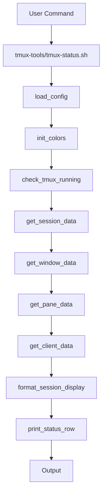
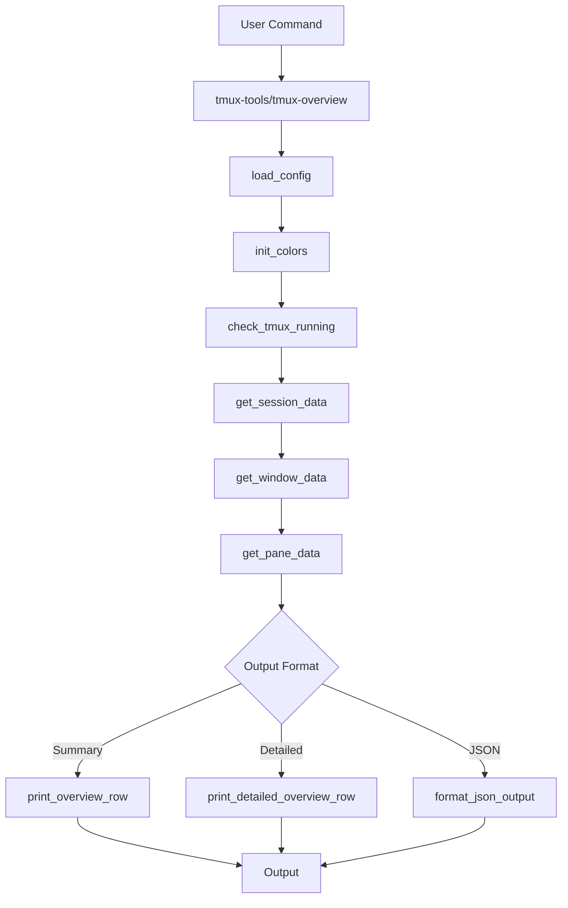

# Architecture Overview

This document provides a technical overview of tmux-tools architecture, covering the modular design, data flow, and integration patterns that make the toolkit extensible and maintainable.

## Design Philosophy

| Principle | Implementation | Benefit |
|-----------|----------------|----------|
| **Modularity** | Shared libraries | Eliminate code duplication |
| **Consistency** | Unified interface | Predictable behavior |
| **Extensibility** | Plugin-ready architecture | Future enhancements |
| **Backward Compatibility** | Original scripts preserved | Maintained functionality |
| **Configuration-Driven** | YAML-based customization | No code changes needed |

## Project Structure

```
tmux-tools/
├── tmux-tools              # Unified command interface
├── tmux-status.sh          # Legacy tabular status display
├── tmux-overview           # Legacy session overview tool
├── lib/                    # Shared library modules
│   ├── tmux_core.sh        # Core tmux operations
│   ├── tmux_display.sh     # Display formatting utilities
│   ├── tmux_colors.sh      # Color management and theming
│   └── tmux_config.sh      # Configuration handling
├── docs/                   # Documentation
├── _attic/                 # Historical/archived files
└── LICENSE                 # MIT license
```

## Component Architecture

### 1. Unified Interface (`tmux-tools`)

The central command dispatcher that provides a consistent entry point for all functionality.

```bash
# Command routing structure
tmux-tools <command> [options]
├── status     → tmux-status.sh functionality
├── overview   → tmux-overview functionality
├── rename     → Session/window renaming
├── config     → Configuration management
├── help       → Documentation
└── version    → Version information
```

**Key Features**:
- Command validation and routing
- Consistent option parsing
- Error handling and user feedback
- Library path resolution

### 2. Core Library (`lib/tmux_core.sh`)

Provides fundamental tmux operations used by all tools.

**Core Functions**:

| Function | Purpose | Used By |
|----------|---------|---------|
| `check_tmux_available()` | Verify tmux installation | All tools |
| `check_tmux_running()` | Validate tmux server | All tools |
| `get_session_data()` | Retrieve session information | Status, Overview |
| `get_window_data()` | Get window details | Status, Overview |
| `get_pane_data()` | Extract pane information | Status, Overview |
| `get_client_data()` | Client connection details | Status |
| `get_attachment_indicator()` | Session attachment status | Status, Overview |
| `rename_session()` | Safe session renaming | Rename operations |
| `rename_window()` | Safe window renaming | Rename operations |

**Data Flow Pattern**:
```
tmux server → tmux_core.sh → formatted data → display modules
```

### 3. Display Formatting (`lib/tmux_display.sh`)

Handles output formatting and visual presentation.

**Display Functions**:

| Function | Purpose | Output Format |
|----------|---------|---------------|
| `print_status_row()` | Table row formatting | Tabular status |
| `print_status_header()` | Table headers | Tabular status |
| `print_overview_row()` | Tree structure | Overview display |
| `format_session_display()` | Session name formatting | Both tools |
| `format_window_display()` | Window name formatting | Both tools |

**Formatting Pipeline**:
```
Raw data → format functions → color functions → output
```

### 4. Color Management (`lib/tmux_colors.sh`)

Centralized color theme system supporting multiple visual environments.

**Theme Architecture**:
```bash
init_colors() → load_theme() → set_color_codes() → apply_colors()
```

**Supported Themes**:

| Theme | Use Case | Colors | Purpose |
|-------|----------|--------|----------|
| `default` | General use | Balanced | Standard terminals |
| `vibrant` | High contrast | Bright/saturated | Dark themes |
| `subtle` | Professional | Muted | Work environments |
| `monochrome` | Accessibility | Single color | Consistency |
| `none` | Scripting | No colors | Automation |

**Color Detection**:

| Method | Variables | Fallback |
|--------|-----------|----------|
| Environment | `TMUX_TOOLS_THEME`, `NO_COLOR` | User preference |
| Terminal capability | Auto-detection | Compatibility check |
| Graceful fallback | No-color mode | Always works |

### 5. Configuration System (`lib/tmux_config.sh`)

YAML-based configuration with hierarchical loading and validation.

**Configuration Loading Hierarchy**:
1. `~/.tmux-tools.yaml`
2. `~/.tmux-tools.yml`
3. `~/.config/tmux-tools/config.yaml`
4. `~/.config/tmux-tools/config.yml`
5. `./tmux-tools.yaml`
6. `./tmux-tools.yml`

**Configuration Processing**:
```
YAML file → parse_yaml_value() → validate_config() → apply_settings()
```

## Data Flow Architecture

### Session Status Display Flow



### Session Overview Display Flow



## Integration Patterns

### Library Loading

All components use a consistent library loading pattern:

```bash
# Library path resolution
SCRIPT_DIR="$(cd "$(dirname "${BASH_SOURCE[0]}")" && pwd)"
LIB_DIR="${TMUX_TOOLS_LIB_PATH:-${SCRIPT_DIR}/lib}"

# Load required libraries
source "${LIB_DIR}/tmux_core.sh"
source "${LIB_DIR}/tmux_display.sh"
source "${LIB_DIR}/tmux_colors.sh"
source "${LIB_DIR}/tmux_config.sh"
```

### Error Handling Pattern

Consistent error handling across all components:

```bash
# Check dependencies
check_tmux_available || exit 1
check_tmux_running || exit 1

# Function error handling
get_session_data() {
    local data
    if ! data=$(tmux list-sessions -F "#{session_name}|#{session_created}"); then
        echo "Error: Unable to retrieve session data" >&2
        return 1
    fi
    echo "$data"
}
```

### Configuration Integration

Components integrate configuration through standardized patterns:

```bash
# Load configuration
load_config

# Get configuration values with defaults
theme=$(get_config_value "display.theme" "default")
session_pool=$(get_config_value "naming.session_pool" "cities")

# Apply configuration
init_colors "$theme"
```

## Extensibility Design

### Plugin Architecture Foundation

The modular design supports future plugin development:

```bash
# Plugin loading pattern (future)
for plugin in "${PLUGIN_DIR}"/*.sh; do
    [[ -f "$plugin" ]] && source "$plugin"
done

# Plugin registration
register_name_generator "ai_names" "ai_suggest_name"
register_output_format "csv" "format_csv_output"
register_theme "corporate" "init_corporate_theme"
```

### Custom Name Generators

The naming system supports extensible name generation:

```bash
# Built-in generators
get_session_names() {
    case "$pool" in
        "cities") echo "${CITY_NAMES[@]}" ;;
        "mammals") echo "${MAMMAL_NAMES[@]}" ;;
        "custom") get_custom_names "sessions" ;;
        *) echo "Error: Unknown pool: $pool" >&2; return 1 ;;
    esac
}

# Extension point for new generators
get_custom_names() {
    local type="$1"
    local config_key="naming.custom_${type}"
    parse_yaml_array "$config_key"
}
```

### Output Format Extension

The display system supports new output formats:

```bash
# Format dispatch pattern
case "$format" in
    "compact") print_status_compact ;;
    "detailed") print_status_detailed ;;
    "json") print_status_json ;;
    "csv") print_status_csv ;;  # Extension point
    "xml") print_status_xml ;;  # Extension point
    *) echo "Error: Unknown format: $format" >&2; return 1 ;;
esac
```

## Performance Considerations

### Data Caching Strategy

tmux-tools employs selective caching for performance:

```bash
# Session data caching (future enhancement)
cache_tmux_data() {
    local cache_file="/tmp/tmux-tools-cache-$$"
    local cache_ttl=5  # seconds

    if [[ -f "$cache_file" ]] && [[ $(($(date +%s) - $(stat -f %m "$cache_file"))) -lt $cache_ttl ]]; then
        cat "$cache_file"
    else
        tmux list-panes -a -F "#{session_name}|#{window_index}|..." | tee "$cache_file"
    fi
}
```

### Efficient Data Retrieval

Optimized tmux queries reduce server load:

```bash
# Single comprehensive query instead of multiple calls
get_all_data() {
    tmux list-panes -a -F "#{session_name}|#{window_index}|#{pane_index}|#{pane_current_command}|#{pane_current_path}|#{client_width}"
}
```

### Memory Management

Bash array handling for large session counts:

```bash
# Process streaming data instead of loading everything into memory
process_sessions() {
    tmux list-sessions -F "#{session_name}|#{session_created}" | while IFS='|' read -r name created; do
        process_session "$name" "$created"
    done
}
```

## Security Considerations

### Input Validation

| Input Type | Validation | Pattern | Purpose |
|------------|------------|---------|----------|
| Session names | Regex pattern | `^[a-zA-Z0-9_-]+$` | Security |
| User parameters | Type checking | Various | Safety |
| Configuration | YAML syntax | Schema validation | Integrity |

### Safe Command Execution

| Method | Technique | Protection |
|--------|-----------|------------|
| Quoted arguments | Parameter quoting | Injection prevention |
| Command validation | Input checking | Command safety |
| Error handling | Return code checks | Failure detection |

### Configuration File Security

Configuration files are validated for safety:

```bash
validate_config_file() {
    local file="$1"

    # Check file permissions
    [[ $(stat -f %Mp%Lp "$file") -lt 644 ]] || {
        echo "Warning: Configuration file is world-writable: $file" >&2
    }

    # Validate YAML syntax
    parse_yaml_value "test" < "$file" >/dev/null
}
```

## Testing Strategy

### Unit Testing Framework

The modular design enables comprehensive testing:

```bash
# Test library functions in isolation
test_get_attachment_indicator() {
    assertEquals " " "$(get_attachment_indicator 0)"
    assertEquals "•" "$(get_attachment_indicator 1)"
    assertEquals "5" "$(get_attachment_indicator 5)"
}
```

### Integration Testing

End-to-end testing with real tmux sessions:

```bash
test_full_workflow() {
    # Setup test environment
    tmux new-session -d -s test_session

    # Test commands
    output=$(./tmux-status.sh | grep test_session)
    assertNotNull "$output"

    # Cleanup
    tmux kill-session -t test_session
}
```

### Performance Testing

Automated performance monitoring:

```bash
test_large_session_performance() {
    # Create 50 test sessions
    for i in {1..50}; do
        tmux new-session -d -s "perf_test_$i"
    done

    # Measure execution time
    start_time=$(date +%s%N)
    ./tmux-status.sh >/dev/null
    end_time=$(date +%s%N)

    execution_time=$(( (end_time - start_time) / 1000000 ))  # Convert to milliseconds
    assertTrue "Performance test failed: ${execution_time}ms > 2000ms" "[ $execution_time -lt 2000 ]"
}
```

## Future Architecture Enhancements

### Planned Improvements

| Priority | Feature | Purpose | Impact |
|----------|---------|---------|--------|
| 1 | Plugin System | Dynamic loading | Extensible generators |
| 2 | API Layer | RESTful interface | Remote management |
| 3 | WebSocket Integration | Real-time monitoring | Live updates |
| 4 | Distributed Sessions | Multi-server support | Scalability |
| 5 | AI Integration | Context-aware naming | Intelligent automation |

### Backward Compatibility Strategy

| Component | Approach | Guarantee |
|-----------|----------|----------|
| Original scripts | Preserved functionality | `tmux-status.sh`, `tmux-overview` |
| Library changes | Versioned interfaces | API stability |
| Configuration | Migration support | Format evolution |
| Command-line | Interface stability | Consistent CLI |

## Conclusion

The tmux-tools architecture balances simplicity with extensibility, providing a solid foundation for both current functionality and future enhancements. The modular design enables easy maintenance, testing, and feature development while preserving the reliability and performance expected from command-line tools.

## Related Documentation

| Guide | Focus | Audience |
|-------|-------|----------|
| [Installation](installation.md) | Setup and deployment | All users |
| [Usage](usage.md) | Practical application | End users |
| [Configuration](configuration.md) | Customization | Power users |
| [Development](development.md) | Contributing | Developers |